# Introduction to core.btree-vector

This document is unlikely to be of interest, unless you want to know
how and why the data structures and operations in the
core.btree-vector library work, and similarly for Clojure's built in
vector data structure.

My original motivation for writing this library was to have an
implementation of an immutable vector that supports O(log N) time
concatenation operations, worst case, which is significantly faster
than linear time behavior you get if you evaluate `(into v1 v2)` for
two Clojure vectors.

These new vectors should still support all existing operations on
Clojure vectors as efficiently as Clojure vectors do, or at worst be a
small constant factor slower.

The research papers about the RRB tree data structure claim that it
provides that, but everything I have read so far on RRB trees leave
out some details of implementation that are not clear to me how they
should be performed, and [all of the RRB Tree implementations I have
found so
far](https://github.com/clojure/core.rrb-vector/blob/master/doc/rrb-tree-notes.md)
have errors.  Without clearly stated invariants, it can be difficult
to approach an existing implementation and see what changes ought to
be made that will be correct, or indeed if that is even possible while
preserving the performance guarantees.

So while this article may be extended to give details on how all
operations are implemented efficiently, the focus here is on ensuring
that creating a sub-vector of an existing vector, and creating a
concatenation of two existing vectors, can be done in worst case O(log
N) time.

I thank Glen Peterson for pointing out in the comments and code of the
`RrbTree` class of his [Paguro
library](https://github.com/GlenKPeterson/Paguro) that B-trees are a
way to simplify understanding how to maintain tree invariants for a
vector data structure that supports sub-vector and concatenation
operations.  He may well have came up with these invariants and
methods of maintaining them before I did.  I have not checked his code
carefully enough to tell.

Even if he did not, I would be very surprised if no one else has
already devised proofs of the things below, given how long B-trees
have been known about.  If you know of a published work somewhere that
covers this, I would very much appreciate a reference to it.  I have
not found such a thing yet.

## Using invariants to develop programs

One good way to reason carefully about all possible behaviors of a
program is by stating, and mathematically proving, conditions that
must be true at all times during the program's execution.  Such a
condition is called an _invariant_, meaning "unchanging", in the sense
that the condition remains true always.

When implementing a data structure, such invariants are often stated
based upon the "shape" and contents of the data structure.  Then, show
how every operation on that data structure "maintains the invariant",
i.e. if the initial data structure given as input(s) to the operations
satisfy the invariant, then the final data structure does, too.

Aside: There are likely better introductions to invariants for simple
data structures to learn about this topic for the first time, but one
source I found after a brief Internet search is [Lecture Notes on Data
Structure
Invariants](https://www.cs.cmu.edu/~fp/courses/15122-f10/lectures/12-dsinvs.pdf)
from a course given at Carnegie Mellon University.

## Rooted ordered trees

If you are already familiar with trees, as used in many data
structures, feel free to skip this section.

A rooted ordered tree is a tree where there is a distinguished _root
node_.  The root node has a (possibly empty) ordered sequence of child
nodes, where all of those child nodes are distinct from the root node.
If there are any nodes besides the root, each of them also has a
possibly empty ordered sequence of child nodes.  There are no cycles
in the parent-child relationships, i.e. no node can be its own parent,
grandparent, or ancestor of any kind.

The figure below gives one example of a rooted ordered tree.  Rooted
trees are typically drawn with edges (i.e. lines) indicating
parent-child relationships.  In this document, all such trees will be
drawn with the root node at the top, with child nodes always appearing
lower than their parents.

Among child nodes that have the same parent, their relative order will
be indicated by their left-to-right ordering in the drawing.

A node with no children is called a _leaf_ node.  A node with at least
one child is called an _internal_ node.  There is a unique path from
the root to every other node in the tree.

We define the _depth_ of the root node to be 0.  All of the root's
children have depth 1.  The depth of a non-root node is equal to the
depth of its parent, plus 1.

Most kinds of trees described later in this document will have
additional restrictions on their structure.

## B-trees

### Invariants for B-trees

[B-trees](https://en.wikipedia.org/wiki/B-tree) and [B+
trees](https://en.wikipedia.org/wiki/B%2B_tree) were developed to
implement data structures like a Clojure sorted map.  That is, they
can represent a set of key/value pairs where all keys are distinct,
and can be sorted by a [total
order](https://en.wikipedia.org/wiki/Total_order), e.g. integers by
the order `<=`, or strings sorted lexicographically.  The values can
be arbitrary, i.e. they need not be distinct, and need not have any
sorted order relative to each other.  B-trees support efficient lookup
of the value associated with a given key, and many other operations.

We will begin our discussion of B-trees this way, and then later
specialize them for use in representing vectors, where the keys are
restricted to be integer indices in the range 0 up to n-1, where n is
the number of elements in the vector.

Aside: I do not know all differences between B-trees and B+ trees.  I
will refer to what is being described here as B-trees, but mentally
substitute "B+ trees" if that is more precise.  The values in the
trees described here are stored only in the leaf nodes, and the keys
are stored in non-leaf nodes, or optimized away in some special cases
where they need not be stored at all.

The following conditions for a B-tree's structure apply for any
maximum branch factor B that is an integer value at least 3.
b=ceiling(B/2) is B divided by 2, then rounded up to the next integer
if the result is a fraction.  Since B >= 3, b is always at least 2.

The invariants that a B-tree must satisfy are:

(I1) It is a rooted ordered tree.

(I2) All values are stored in leaf nodes.  The key associated with
     each value is also stored with the value.

(I3) All leaf nodes are at the same depth as each other.

(I4) The order of all key/value pairs in a tree is the same as the
     order that the leaf nodes are visited in a [preorder depth-first
     traversal](https://en.wikipedia.org/wiki/Depth-first_search),
     where all children of a node are visited in the same order that
     they are children of their parent.  The order of keys must be
     consistent with the total order specified for the keys.

(I5) All nodes have at most B children.

(I6) All non-root internal nodes have at least b children.  The root
     node has at least 2 children, unless there is only one key/value
     pair in the entire tree, in which case the root has 1 child.

(I7) All internal nodes with A >= 2 children contain A-1 keys.  If we
     number the children, in order, from c[0] up to c[A-1], and the
     keys from k[1] up to k[A-1], then for all j in the range [1,
     A-1], key k[j] must be strictly greater than all keys in the
     subtree of child c[j-1], and less than or equal to all keys in
     the subtree of child c[j].

For now we will leave the value of B arbitrary, and only pick a
particular value for use in examples, and for the core.btree-vector
implementation.

Aside: A special case not mentioned very often is a B-tree with no
key/value pairs, i.e. an empty set of keys.  The exact representation
of an empty B-tree is not a big deal -- e.g.  storing a count field of
0 in the object is a good way.  There might be a root node with no
children in the implementation, but we will not usually consider that
case explicitly everywhere in this document.  If we did, we would
frequently be mentioning that special case, and I would prefer not to
keep mentioning it.

### Definitions of some terms related to B-trees

Feel free to skip over these definitions and come back as and when you
need them.  I wanted to keep them together in this document.  Examples
of all of these definitions are in the next section.

For trees satisfying (I3), we can define the _height_ of a node as the
number of edges in any path from the node down to a leaf node.  For
any node in a tree satisfying (I3), there is only one such number.
The height of all leaf nodes is 0, and for any internal node, its
height is equal to the height of any of its children (which all have
the same height as each other), plus 1.

For any rooted ordered tree T, define _dfs(T)_ to be the ordered list
of nodes of T, in the order they are traversed in a [preorder depth
first traversal](https://en.wikipedia.org/wiki/Depth-first_search) of
T.

Define _nodes(T, d)_ to be the ordered list of nodes obtained by
starting with dfs(T), and removing all nodes that have a depth not
equal to d, keeping the relative order of the nodes with depth d.

For any node N with depth d in a rooted ordered tree T, define N's
_right neighbor_ to be the first node after N in the list nodes(T, d).
If there is no node after N in that list, N has no right neighbor.
Similarly the _left neighbor_ of N is the last node before N in the
list nodes(T, d), if there is such a node.

Note that if a node N has a left neighbor A, then either N and A have
the same parent node, or N's parent PN has a left neighbor that is A's
parent PA.  Similarly if you substitute all occurrences of "left" with
"right" in the previous sentence.

Define the _left fringe_ of a rooted ordered tree as the following set
of nodes.

+ The root node is in the left fringe.
+ If any node is in the left fringe and has children, then its
  left-most (i.e. first) child is also in the left fringe.

The _right fringe_ is defined the same way, replacing all occurrences
of "left" with "right", and "first" with "last".

### B-tree examples, and consequences of the invariants

These example B-trees have max branching B=5, and minimum branch
factor b=3.  Each represents a subset (or all of) this collection of
key/value pairs:

| Key | Value     |
| --- | --------- |
|   2 | "Ellis"   |
|   3 | "John"    |
|   5 | "Hank"    |
|   7 | "Dagny"   |
|  11 | "Hugh"    |
|  13 | "Midas"   |
|  17 | "Eddie"   |
|  19 | "Ragnar"  |
|  23 | "Quentin" |

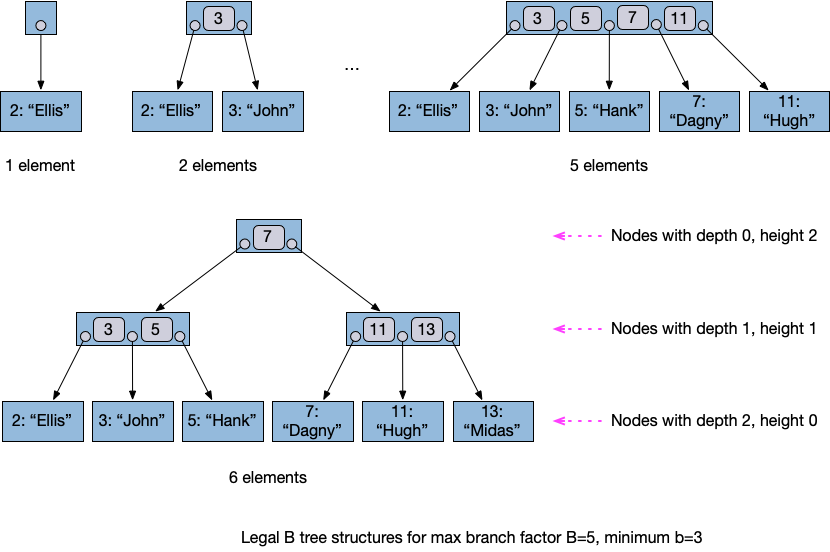

For B=5 and b=3, those are the _only_ tree structures that are legal
for the given number of keys.  In general, if there are less than 2b
keys, all key/value pairs must be direct children of the root, at
depth 1.  There are no other tree structures that satisfy all of the
invariants for so few keys.

There are at least two tree structures that satisfy the invariants for
2b+1 or more keys.  As the number of keys grows, the number of tree
structures satisfying the invariants grows exponentially.  It is
reasonable for a B-tree implementation to allow any tree structure to
be used, as long as it satisfies all of the invariants.

The three B-trees below are all legal for 9 keys, with B=5 and b=3.

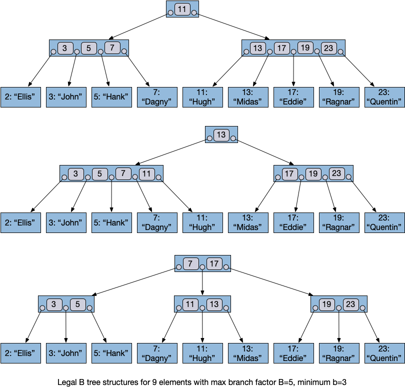

The height of a B-tree is O(log N), where the base of the logarithm is
b.  It can be slightly less than that if enough nodes have branching
factors near B.  Chapter 3 "RRB-Trees" of Jean Niklas L'orange's
thesis contains detailed proofs of this and many other results.

* Jean Niklas L'orange, "Improving RRB-Tree Performance through
  Transience", Master Thesis, 2014,
  [[PDF]](https://hypirion.com/thesis.pdf)

The tree below demonstrates several definitions from the previous
section.

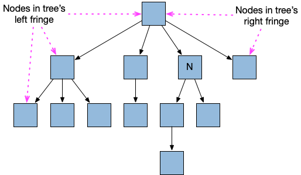

+ dfs(T) = [A, B, C, D, E, F, G, H, I, J, K, L]
+ nodes(T, 0) = [A]
+ nodes(T, 1) = [B, F, H, L]
+ nodes(T, 2) = [C, D, E, G, I, K]
+ nodes(T, 3) = [J]
+ nodes(T, 4) = [] (i.e. the empty list -- there are no nodes at depth
  4 in this tree)
+ The left neighbor of H is F, and the right neighbor of H is L.
+ B has no left neighbor.  The right neighbor of B is F.

### Efficient B-tree split operations

By a split operation, I mean one where you are given a B-tree T and a
key K that exists in T, and the goal is to return a new B-tree T2 that
contains only the key/value pairs of T where the key is K or larger,
in the total order on keys.

By efficient, I mean it runs in time equal to some constant factor
times the height of the tree T, and that the returned data structure
satisfies all of the B-tree invariants.

Note: The corresponding operation that returns a tree with all keys K
or smaller is just the "mirror image" of the split operation above.
If we can make one of them work efficiently, the other will work, too.
And if both of those operations work efficiently, one followed by the
other can be used to achieve the effect of a "sub range" operation,
which given a tree T and a minimum key K1 and a maximum key K2,
returns a tree T2, that contains only those keys K of T such that K1
<= K <= K2.

It turns out to be a fruitful approach to implement a split operation
by first simply removing all leaves for key/value pairs with keys less
than K, and then removing all internal nodes that have no remaining
children after those leaves are removed, as shown in this example:

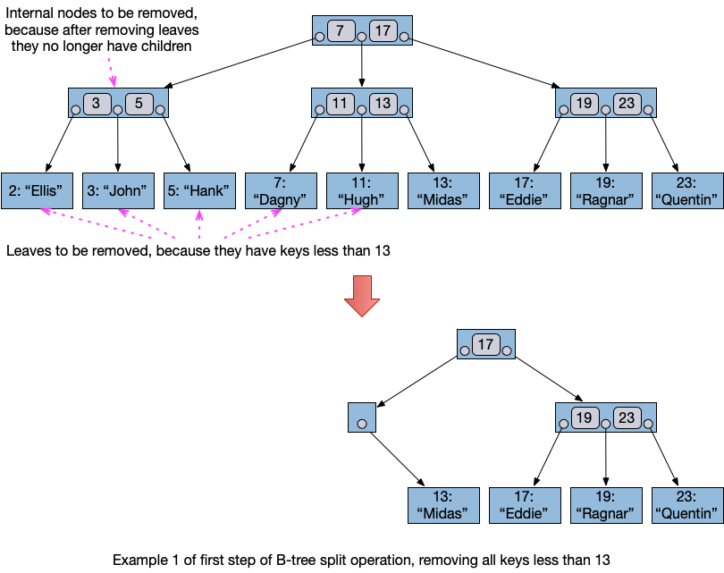

The problem with this intermediate step is that the resulting tree T'
can violate some of the B-tree invariants, in particular invariant
(I6) that restricts the minimum number of children a node must have.

So, we then "fix up" the tree, such that the final tree satisfies all
invariants.  The trick is to do so in worst case O(log N) time, and
prove that the result will always satisfy all of the invariants,
regardless of what tree T and key K were given for the split
operation.

First, observe that in tree T', all internal nodes have the same
number of children they had in T, except perhaps for some of the nodes
in the left fringe of T'.  If we can find a way to correct those
nodes, and preferably a small number of others "near" them, that would
be good.

As a special case, if the number of remaining leaves is at most B,
then we can simply make all of them children of a new root node, and
the resulting tree satisfies all invariants.

Otherwise, we will begin by finding the leaf node in the left fringe
of T', examine its parent node F, try "fixing up" F's number of
children, then work our way upwards along the left fringe towards the
root.  Thus F has at least one child.

There are several cases to consider.  In all of them, all nodes
originally have at most B children in T, and so have at most B
children in T', too.  F is on the left fringe of T', and so has no
left neighbor.  Because F is not a leaf, it is an internal node, and
all nodes at its same depth are also internal nodes.

Case (split1): F has no right neighbor.  Thus F is the only node at
its depth d in the tree.  Either F is the root node, or F's parent is
also the only node at its depth d-1 in the tree, and F's grandparent
is the only node at its depth d-2 in the tree, etc. all the way up to
the root.  We can make F the new root node, deleting any ancestor
nodes, and all invariants are satisfied by this new tree.  In this
case, the height of the resulting tree might be less than the tree T
we started with.

In all other split cases below, F has a right neighbor node R, both at
depth d.  Thus neither F nor R are the root node of T', because root
nodes have no neighbors.  R is not on the left fringe of T', so has
the same number of children in T and T', which must be in the range
[b, B], because T satisfies all invariants.

Case (split2): F has a number of children in the range [b, B].  F does
not violate any invariants by itself, so we are done with F.  Continue
with F's parent.

Case (split3): F has a number of children in the range [1, b-1], which
violates invariant (I6).  Subcases we will consider are (split4) and
(split5) below.

Case (split4): The total number of children of F and R is at most B.
Take all of F's children and make them become children of R instead,
preserving their relative order in nodes(T', d).  Now we remove F,
which has no children, and the node that was F's parent has one less
child than before (possibly none, now that F has been removed).

Case (split5): The total number of children of F and R is at least
B+1.  R has a number of children in range [b, B].  Because this is a
sub-case of (split3), F has a number of children in range [1, b-1].
Thus the total number of children is in the range [B+1, B+b-1].  Pick
a new number X of children for F to have, taking some from R's
leftmost children so that the relative order of nodes(T', d) remains
the same.  There may in some case be multiple choices for the value of
X, but X=b always leaves at least B+1-b children left over for R.
Because b=ceiling(B/2), B+1-b is at least b, so in the resulting tree
both F and R will both have at least b children.

If we hit case (split1), or if F was the root node, we are done.  If F
was not the root and we hit any other case, let the new value of F
become what was F's parent, and check the cases above again.  A new
possibility that did not exist the first time is that the new F node
might have 0 children, if we hit case (split4) earlier.  This
possibility is covered by the case below.

Case (split6): F has 0 children.  This case can only occur if we have
hit case (split4) earlier, when the removed node had a right sibling.
Thus the current F must have a right sibling, too.  Remove the current
F, which like case (split4) reduces the number of children of the
current F's parent by 1, and we might hit this case again, but
eventually at some ancestor of the current F we must hit a different
case.

It is possible that the root node might have only one child remaining,
even if we never hit case (split1), e.g. if we hit case (split4) for
the left child of the root, and removed it, when the root had only two
children to start with.  If so, since there are at least B+1 leaves,
make that one child of the root become the new root node.

At most two nodes per depth value of the tree T' are modified in place
for a mutable implementation of this operation, or allocated and
initialized for an immutable implementation.  Thus the run time is
O(B*H), where H is the height of the tree, which is O(log N).

### Examples demonstrating B-tree split operations

The examples in this section are intended to demonstrate each of the
cases of the proof of the split operation in the previous section.
Hold onto your eyeballs, because the example trees have to get a bit
larger in order to hit some of the cases.

In this section, to avoid unnecessary clutter we draw the B-trees with
keys in the leaves, but no values, since the main relevant factor here
is the structure of the trees.  We also do not bother showing the keys
in the internal nodes.  They do need to be updated during some of
these operations, but in a fairly obvious way, I think, that showing
them explicitly would not help much.  Internal nodes are labeled with
letters simply to make it easier to refer to them in the text, and see
how they correspond to each other from one step to the next.

The following tree will be used as the initial tree T on which to
perform a split operation for most of the examples in this section.

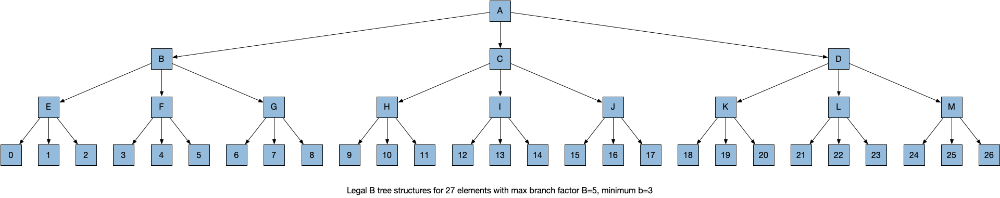

In these examples, nodes colored pink are ones that must be freshly
allocated and initialized in an immutable implementation.  Even in a
mutable implementation, at least some of the ones colored pink would
need to be mutated in place (but not all of them).

#### Split T keeping keys 20 and larger

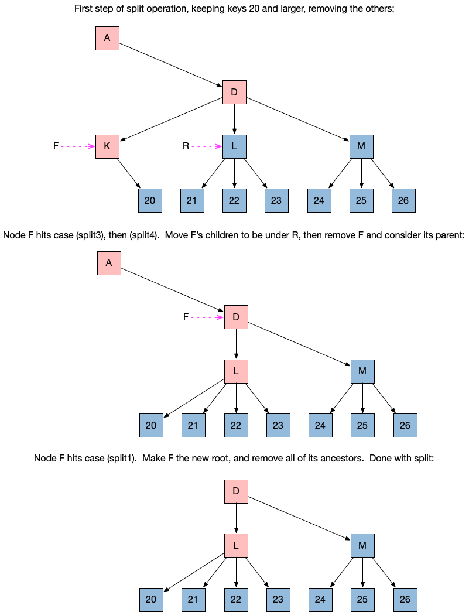

#### Split T keeping keys 17 and larger

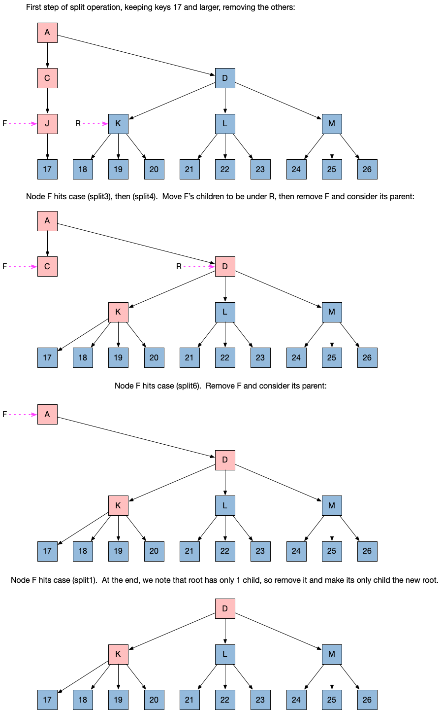

#### Split T keeping keys 3 and larger

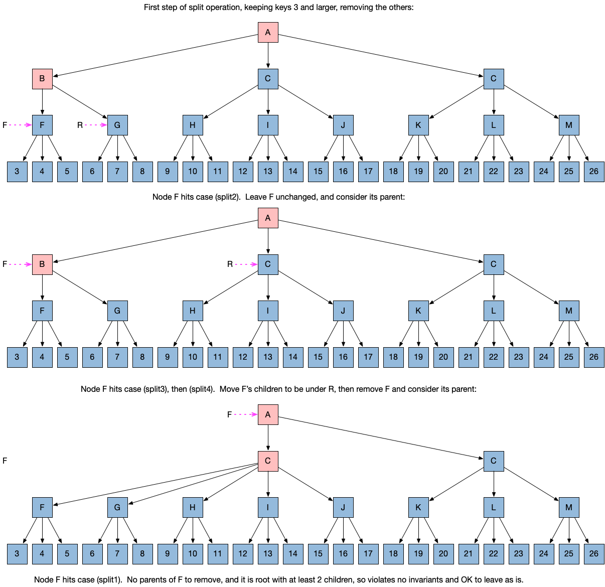

#### Split keeping keys 1 and larger

Note that the starting tree here is different than the ones above.
The tree used earlier cannot be used to demonstrate hitting case
(split5), but this one can.

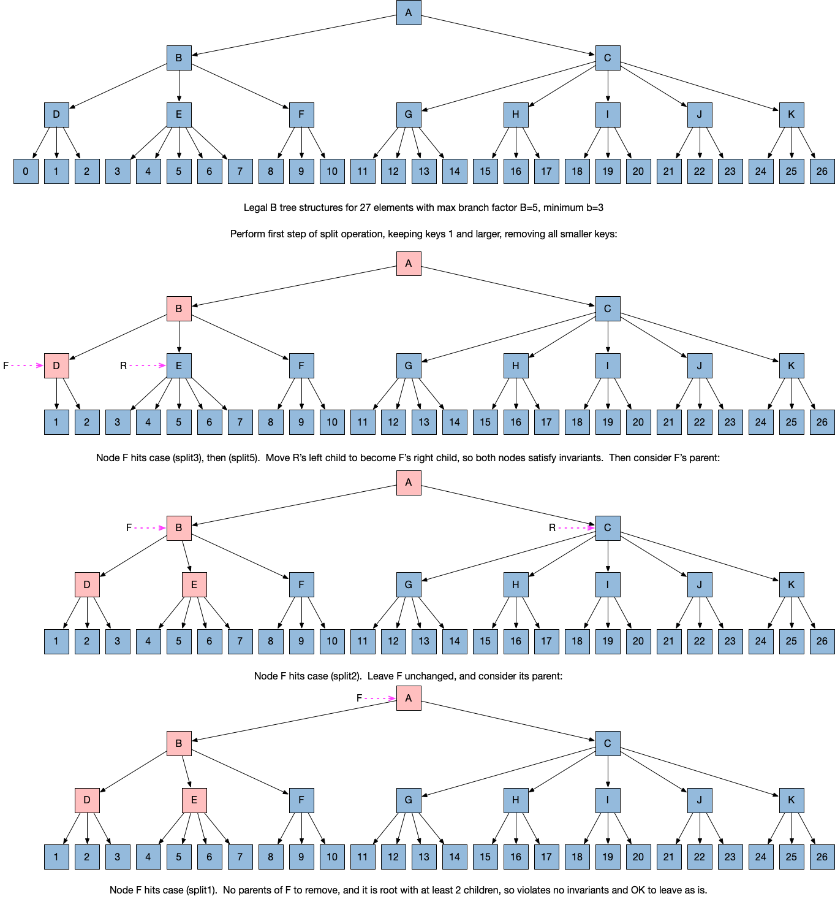

### Efficient B-tree concatenate operations

Finally, the section that was my original motivation for writing all
of this.  I found the easier proof/algorithm for the split operation
first, as kind of a warm-up exercise, and only after that realized
that it could be used as part of a proof/algorithm for efficient
concatenation, too.

Another reason I started with the split operation is due to concerns I
had that even if the RRB tree data structure can implement
concatenation of two RRB trees, it was not so clear that one can start
with an RRB tree, perform a split operation on it, and end with
another tree satisfying all RRB tree invariants.  The fact that this
definitely can be done with B-trees I found very encouraging.

We are given two B-trees T1 and T2, and all keys in T1 are less than
all keys in T2.  We want to combine them to produce a tree T3 that
contains the union of all key/value pairs of T1 and T2.  The
restriction that all keys in T1 are less than all keys in T2 is all
that we need for B-trees that represent vectors, and it is a simpler
operation than the general case of arbitrary keys.  Perhaps later I
can write more about the general case of combining two arbitrary sets
of key/value pairs represented as B-trees.

While there might be a way to streamline this presentation somewhat by
combining the two cases below into one, this is the easiest way to
understand it that I know now.

T1 has root node R1 and T2 has root node R2.

#### Concatenate two B-trees with the same height

Consider the case that T1 and T2 have the same height as each other.

If R1 and R2 have a total number of children at most B, then create a
new root R3 that has all of the children of R1, nodes(T1, 1), followed
by all of the children of R2, nodes(T2, 1).

If the total number of children is at least B+1, then by the
invariants that T1 and T2 satisfy, the total is at most 2*B.  Divide
up the children into two groups such that both groups have a number of
nodes in the range [b, B], and put the first group under a new node
R1', and the second under a new node R2'.  b+b is less than or equal
to B+1, so it is always possible to divide them up in this way.  Then
create a new root node R3 that has R1' as the first child, and R2' as
the second.

#### Concatenate two B-trees with the different heights

Now we consider the case that T1 has height H1, T2 has a different
height H2.  We will walk through the details for the case H1 < H2.
The case H1 > H2 is handled similarly -- it is simply the "mirror
image" of the case H1 < H2.

If R2 has less than B children, create a new left child node R2.  If
H1 = H2-1, then make R1 the new left child of R2.  If H1 < H2-1, then
make a path containing (H2-1-H1) new nodes, the first of which is the
new left child of R2, and the last of which is the parent of R1.  This
will cause the resulting tree to have all leaves at the same depth.

If R2 has B children, then make a new root node R3 with right child
R2, and left child a path of (H2-H1) nodes, the last of which is a
parent of R1.  Again, this causes the resulting tree to have all
leaves at the same depth.

This tree might satisfy all invariants, and if so, we are done.  If it
does not satisfy all invariants, it will be because R1 has less than b
children, but also because some of the new nodes added only have 1
child.

The key thing to notice is that even if the tree does not satisfy all
invariants, we can view it as a tree that _could be the result_ of
starting with a tree that satisfied all invariants, and then we did a
split operation that kept only the keys at least the smallest key that
is now in the tree.  The left fringe nodes contain some nodes from T2,
and perhaps some new ones.  All descendants of R2 already satisfy the
invariants, so we can start with R2 and work our way up, fixing up the
tree so it satisfies the invariants, as described in the section on
the split operation.

If it is any clearer, there is another way to view it: The algorithm
for fixing up a tree after removing nodes for a split works on any
tree for which the only nodes that violate the invariants are all on
the left fringe (or all on the right fringe), and they only violate
them by having too few children.  The intermediate tree constructed by
the method described above can also only violate invariants in that
same way.

### Examples demonstrating B-tree concatenate operations

The cases of T1 and T2 with the same height seem straightforward
enough that an example is not necessary.  We will give a couple of
examples where T1 has height less than T2.

#### Concatenate T1 to larger height T2 that has fewer than B children in its root

In the first concatenation example, T2's root node R2 has fewer than B
children, so we add a new child to R2, then fix up the left fringe
from R1 on up, as we did for a split operation.

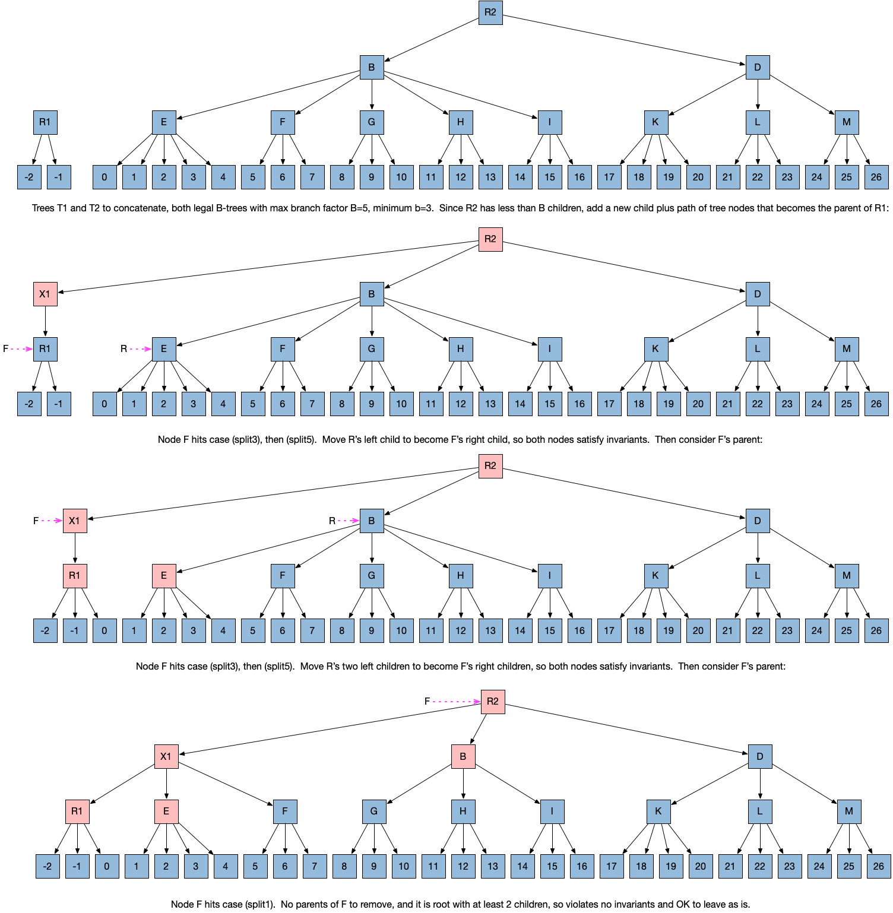

#### Concatenate T1 to larger height T2 that has B children in its root

In this concatenation example, T2's root node R2 has B children, so we
add a new parent of R2, and a path from that new root to R1, then fix
up the left fringe from R1 on up.

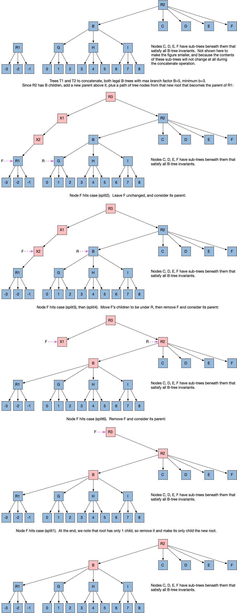

## Invariants for Clojure's PersistentVector implementation

Clojure's `PersistentVector` implementation (often abbreviated "PV"
here) satisfies invariants that are similar to the ones described in
the section [Invariants for B-trees](#invariants-for-b-trees), but
there are differences.

We introduce one new definition that is helpful when describing PVs:

An _array node_ is an internal node that has height 1, i.e. it is a
parent of leaf nodes, where the leaf nodes contain the vector
elements.

The invariants that B-trees and PVs have in common are given first.
Note that PVs never store the keys, i.e. the vector index values in
the range 0 up to n-1, since given the invariants, they can be
determined from a value's position in the tree.

(I1) It is a rooted ordered tree.

(I3) All leaf nodes are at the same depth as each other.

(I4) The order of all key/value pairs in a tree is the same as the
     order that the leaf nodes are visited in a [preorder depth-first
     traversal](https://en.wikipedia.org/wiki/Depth-first_search),
     where all children of a node are visited in the same order that
     they are children of their parent.  The order of keys must be
     consistent with the total order specified for the keys.

(I5) All nodes have at most B children.

(I2) is almost the same for PVs, except that besides the tree, PVs
also have a "tail" array that stores from 1 up to B vector elements at
the end of the vector (minor exception: if the vector is empty, the
tail is also empty).

PVs do not satisfy (I6) (i.e. all non-root internal nodes have at
least b children) at all.  Instead they satisfy these invariants:

(I8) All internal nodes that are not on the right fringe, and all
     array nodes, have exactly B children.

(I9) Internal nodes on the right fringe (except the one array node on
     the right fringe) must have at least one child, but are allowed
     to have less than B children.

The tail array serves several purposes:

+ Because it always contains the last vector element, it guarantees
  that the `peek` operation to retrieve the last element is O(1) time.
+ It makes appending an element, or removing the last element, O(1)
  time in most cases, by creating a new tail array.  The only
  situations when it takes O(log N) time (log base B) is when the last
  vector element is removed and the tail has only 1 element, or when a
  new element is appended and the tail contains B elements.
+ It makes it fast and simple to preserve the invariants that all
  array nodes have B children, because a new array node is only added
  to the tree when the tail contains a full B=32 elements, then a new
  element is appended.

A good property of the PV invariants, "packing everything to the left"
in the tree, is that one can start at the root, and use the desired
vector element index value `i` and very tiny amount of integer
arithmetic to determine which child to go to next, and you will end up
at the element at index `i`.

A good source for more details on that property, and many others, with
examples, is Jean Niklas L'orange's series of articles ["Understanding
Clojure's Persistent
Vectors"](https://hypirion.com/musings/understanding-persistent-vector-pt-1),
and his Master's thesis linked earlier in this document.

A disadvantage of the PV invariants is that, in general, there is no
way to concatenate two vectors in less time than linear in the size of
the second vector.  The range of number of allowed children in B-tree
nodes is what enables fast concatenation, but also what makes looking
up elements in a B-tree a little bit slower than in a PV tree.

### Why store relative index values instead of absolute ones?

TBD: Not sure where is best to introduce this text.

Typically when B-trees are used, removing one key/value pair leaves
all of the remaining key/value pairs unchanged.  With the
core.btree-vector, if start with a vector with 10 elements, where the
keys range from 0 through 9, and take a sub-vector starting from index
3 up through 9, inclusive, the returned vector should have 7 elements
with keys 0 through 6.

Similarly, when concatenating two vectors, the keys of the first
vector remain the same, but the keys of the second vector are all
larger in the returned vector than they were in the second input
vector (unless the first vector was empty).

Thus it is important that if we do not want to require all sub-vector
and concatenation operations to take linear time, the keys should not
be explicitly stored as absolute numbers.  Instead they are stored as
relative numbers in each sub-tree, relative to the number of elements
that exist in earlier sub-trees.

# Details to double check later

TBD: Compare this terminology with that used in Clojure source code
for PersistentVector and Vector.

TBD: Try to minimize the number of differences in terminology used for
different tree data structures that this library deals with, and make
it clear up front and on first definition what the terminology
differences are as used here, versus in some popular reference on tree
terminology, perhaps the Wikipedia article on tree data structures, or
CLRS.  If I give Niklas L'orange's articles on PersistentVector as a
reference, reread it for terminology and any differences to what is
used here.

TBD: Is the invariant that all leaf nodes are at the same depth as
each other important?  Why?  What would go wrong if we tried to allow
trees with leaf nodes at different depths?  At least one answer is
that the algorithm described in section ["Efficient B-tree split
operations"](#efficient-b-tree-split-operations) would need to be
generalized to work when the right neighbor of a node on the left
fringe is a leaf, instead of another internal node.  I do not know if
that is even possible to do.
