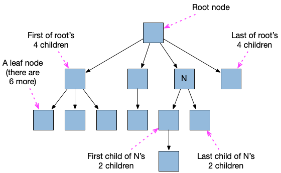
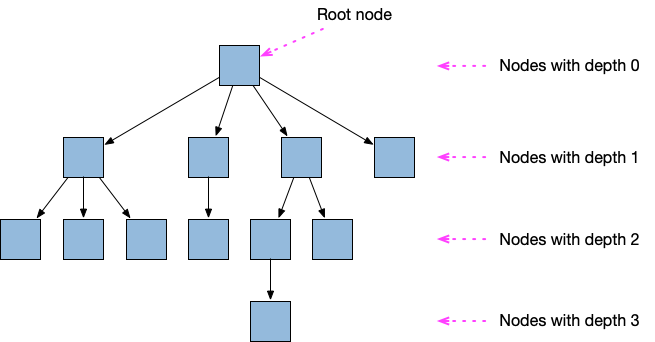
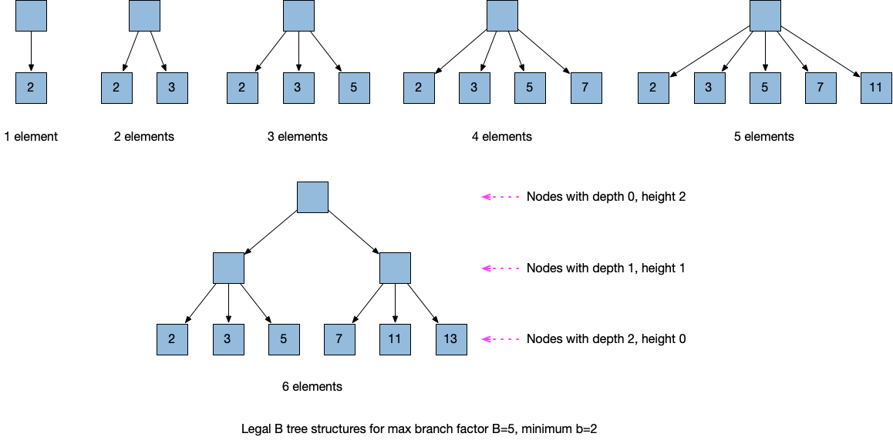
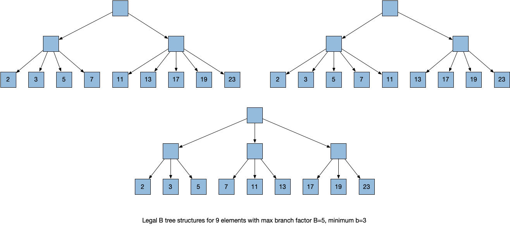

# Introduction to core.btree-vector

## Using invariants to develop programs

One good way to reason carefully about all possible behaviors of a
program is by stating, and mathematically proving, conditions that
must be true at all times during the program's execution.  Such a
condition is called an _invariant_, meaning "unchanging", in the sense
that the condition remains true always.

When implementing a data structure, such invariants are often stated
based upon the "shape" and contents of the data structure.  Then, show
how every operation on that data structure "maintains the invariant",
i.e. if the initial data structure given as input(s) to the operations
satisfy the invariant, then the final data structure does, too.

Aside: There are likely better introductions to invariants for simple
data structures to learn about this topic for the first time, but one
source I found after a brief Internet search is [Lecture Notes on Data
Structure
Invariants](https://www.cs.cmu.edu/~fp/courses/15122-f10/lectures/12-dsinvs.pdf)
from a course given at Carnegie Mellon University.

## Rooted ordered trees

If you are already familiar with trees, as used in many data
structures, feel free to skip this section.

A rooted ordered tree is a tree where there is a distinguished _root
node_.  The root node has a (possibly empty) ordered sequence of child
nodes, where all of those child nodes are distinct from the root node.
If there are any nodes besides the root, each of them also has a
possibly empty ordered sequence of child nodes.  There are no cycles
in the parent-child relationships, i.e. no node can be its own parent,
grandparent, or ancestor of any kind.

The figure below gives one example of a rooted ordered tree.  Rooted
trees are typically drawn with edges (i.e. lines) indicating
parent-child relationships.  In this document, all such trees will be
drawn with the root node at the top, with child nodes always appearing
lower than their parents.

Among child nodes that have the same parent, their relative order will
be indicated by their left-to-right ordering in the drawing.

A node with no children is called a _leaf_ node.  A node with at least
one child is called an _internal_ node.  There is a unique path from
the root to every other node in the tree.

We define the _depth_ of the root node to be 0.  All of the root's
children have depth 1.  The depth of a non-root node is equal to the
depth of its parent, plus 1.

Most kinds of trees described later in this document will have
additional restrictions on their structure.

## B-trees

### Invariants for B-trees

[B-trees](https://en.wikipedia.org/wiki/B-tree) and [B+
trees](https://en.wikipedia.org/wiki/B%2B_tree) were originally
developed to implement data structures like a Clojure sorted map,
representing a set of key/value pairs, where the keys can be sorted by
a [total order](https://en.wikipedia.org/wiki/Total_order).

As implemented by the core.btree-vector library, all of the keys are
integer indices, ranging from 0 up to n-1, where n is the number of
elements in the vector.  This is a fairly special case for B trees,
and leads to some simplifications in the data structure.

I do not know all differences between B-trees and B+ trees.  I will
refer to what is being described here as B-trees, but mentally
substitute "B+ trees" if that is more precise.  The values in the
trees described here are stored only in the leaf nodes, and the keys
are stored in non-leaf nodes, or optimized away in some special cases
where they need not be stored at all.

The following conditions for a B-tree's structure apply for any
maximum branch factor B that is an integer value at least 3.

b=ceiling(B/2) is B divided by 2, then rounded up to the next integer
if the result is a fraction.  Since B >= 3, b is always at least 2.

The invariants that a B-tree must satisfy are:

(I1) It is a rooted ordered tree.

(I2) All values are stored in leaf nodes.

(I3) All leaf nodes are at the same depth as each other.

(I4) The order of all values in a tree is the same as the order that
     the leaf nodes are traversed in a [depth-first
     traversal](https://en.wikipedia.org/wiki/Depth-first_search),
     where all children of a node are visited in the same order that
     they are children of their parent.

(I5) All nodes have at most B children.

(I6) All non-root internal nodes have at least b children.  The root
     node has at least 2 children, unless there is only one value in
     the entire tree, in which case the root has 1 child.

For now we will leave the value of B arbitrary, and only pick a
particular value for use in examples, and for the core.btree-vector
implementation.

For trees satisfying (I3), we can define the _height_ of a node as the
number of edges in any path from the node down to a leaf node.  For
any node in a tree satisfying (I3), there is only one such number.
The height of all leaf nodes is 0, and for any internal node, its
height is equal to the height of any of its children (which all have
the same height as each other), plus 1.

Aside: A special case not mentioned very often is a B tree with no
values, i.e. an empty set of values.  The exact representation of an
empty B tree is not a big deal -- e.g.  storing a count field of 0 in
the object is a good way.  There might be a root node with no children
in the implementation, but we will not usually consider that case
explicitly everywhere in this document.  If we did, we would
frequently be mentioning that special case, and I would prefer not to
keep mentioning it.

### B-tree examples, and consequences of the invariants

These example B-trees have max branching B=5, and minimum branch
factor b=3.  The example elements shown are the first few prime
numbers, in increasing order.

For B=5 and b=3, those are the _only_ tree structures that are legal
for the given number of elements.  In general, if there are less than
2b vector elements, all elements must be direct children of the root,
at depth 1.  There are no other tree structures that satisfy all of
the invariants for so few elements.

There are at least two tree structures that satisfy the invariants for
2b+1 or more elements.  As the number of elements grows, the number of
tree structures satisfying the invariants grows exponentially.  It is
reasonable for a B-tree implementation to allow any tree structure to
be used, as long as it satisfies all of the invariants.

The three B-trees below are all legal for 9 elements, with B=5 and
b=3.

We will call the parent nodes of leaf nodes _array nodes_ (TBD: maybe
a phrase to motivate this choice here).  If the tree has height 1,
then the only non-leaf node, the root node, is an array node.

TBD: Compare this terminology with that used in Clojure source code
for PersistentVector and Vector.

TBD: Try to minimize the number of differences in terminology used for
different tree data structures that this library deals with, and make
it clear up front and on first definition what the terminology
differences are as used here, versus in some popular reference on tree
terminology, perhaps the Wikipedia article on tree data structures, or
CLRS.  If I give Niklas L'orange's articles on PersistentVector as a
reference, reread it for terminology and any differences to what is
used here.

## Invariants for Clojure's PersistentVector implementation

Clojure's `PersistentVector` implementation satisfies some invariants
that are similar to the ones described in the previous section.

Every vector element is stored either as a leaf in a tree, or in an
array of up to 32 elements called the "tail".  The tail array always
contains at least one element if the vector is not empty, which
guarantees that the `peek` operation, which returns the last element
of the vector, always takes O(1) time.

Similar to B-trees, all vector elements are at the same depth as each
other from the root node.

Unlike B-trees, all array nodes always contain exactly B children
(which are vector elements).  "Most" tree nodes are restricted to
contain exactly B children, with only a few nodes described below
allowed to be an exception to that condition.

Define the "right fringe" of a tree as the following set of nodes.

+ The root node is in the right fringe.
+ If the root node has any children, then the right-most (i.e. last)
  child is also in the right fringe.

If the root node has any children, then 

### Why store relative index values instead of absolute ones?

TBD: Not sure where is best to introduce this text.

Typically when B trees are used, removing one key/value pair leaves
all of the remaining key/value pairs unchanged.  With the
core.btree-vector, if start with a vector with 10 elements, where the
keys range from 0 through 9, and take a sub-vector starting from index
3 up through 9, inclusive, the returned vector should have 7 elements
with keys 0 through 6.

Similarly, when concatenating two vectors, the keys of the first
vector remain the same, but the keys of the second vector are all
larger in the returned vector than they were in the second input
vector (unless the first vector was empty).

Thus it is important that if we do not want to require all sub-vector
and concatenation operations to take linear time, the key values
should not be explicitly stored as absolute values.  Instead they are
stored as relative values in each sub-tree, relative to the number of
elements that exist in earlier sub-trees.
